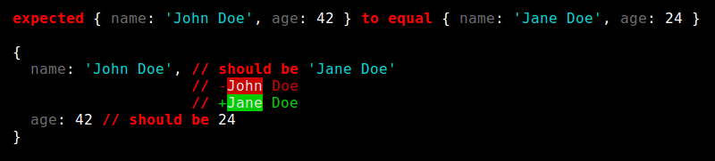
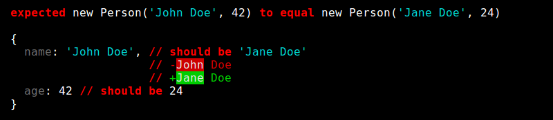
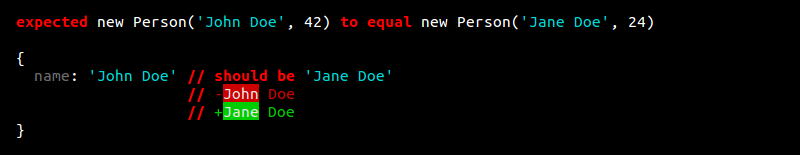
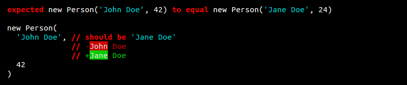
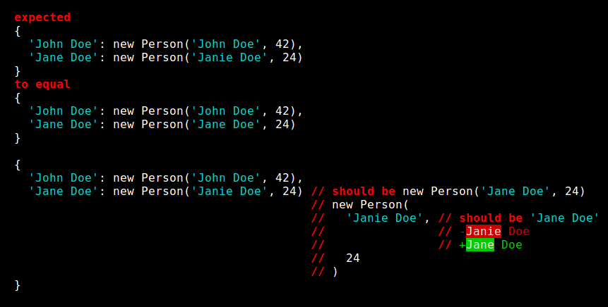

# Unexpected

[](https://gitter.im/sunesimonsen/unexpected?utm_source=badge&utm_medium=badge&utm_campaign=pr-badge&utm_content=badge)

Extensible BDD assertion toolkit inspired by
[expect.js](https://github.com/LearnBoost/expect.js)

```js
expect(window.r, 'to be', undefined);
expect({ a: 'b' }, 'to equal', { a: 'b' });
expect(5, 'to be a', 'number');
expect([], 'to be an', 'array');
expect(window, 'not to be an', Image);
```

[](http://badge.fury.io/js/unexpected)
[](https://travis-ci.org/sunesimonsen/unexpected)
[](https://coveralls.io/r/sunesimonsen/unexpected)
[](https://david-dm.org/sunesimonsen/unexpected)

[Run the test in the browser](http://sunesimonsen.github.io/unexpected/test/tests.html)

## Features

- Extensible
- Fast
- Provides really nice error messages
- Helps you if you misspells assertions
- Compatible with all test frameworks.
- Node.JS ready (`require('unexpected')`).
- Single global with no prototype extensions or shims.
- Cross-browser: works on Chrome, Firefox, Safari, Opera, IE6+,
  (IE6-IE8 with [es5-shim](https://github.com/es-shims/es5-shim)).

## How to use

### Node

Install it with NPM or add it to your `package.json`:

```
$ npm install unexpected
```

Then:

```js
var expect = require('unexpected');
```

### Browser

Include `unexpected.js`.

```html
<script src="unexpected.js"></script>
```

this will expose the expect function under the following namespace:

```js
var expect = weknowhow.expect;
```

### RequireJS

Include the library with RequireJS the following way:

```js
require.config({
    paths: {
        unexpected: 'path/to/unexpected'
    }
});

define(['unexpected'], function (expect) {
   // Your code
});
```

## API

### to be ok

asserts that the value is _truthy_

**ok** / **truthy** / **falsy**: asserts that the value is _truthy_ or not

```js
expect(1, 'to be ok');
expect(true, 'to be ok');
expect(true, 'not to be falsy');
expect({}, 'to be truthy');
expect(0, 'not to be ok');
expect(0, 'to be falsy');
expect(null, 'to be falsy');
expect(undefined, 'to be falsy');
```

**be**: asserts `===` equality

```js
expect(obj, 'to be', obj);
expect(obj, 'not to be', {});
expect(1, 'to be', 1);
expect(1, 'not to be', true);
expect('1', 'not to be', 1);
expect(null, 'not to be', undefined);
expect(null, 'to be null');
expect(0, 'not to be null');
expect(undefined, 'not to be null');
expect(true, 'to be true');
expect(false, 'not to be true');
expect(false, 'to be false');
expect(true, 'not to be false');
expect(undefined, 'to be undefined');
expect(null, 'to be defined');
expect(false, 'to be defined');
expect({}, 'to be defined');
```

**equal**: asserts deep equality that works with objects

```js
expect({ a: 'b' }, 'to equal', { a: 'b' });
expect(1, 'not to equal', '1');
expect({ one: 1 }, 'not to equal', { one: '1' });
expect(null, 'not to equal', '1');
var now = new Date();
expect(now, 'to equal', now);
expect(now, 'to equal', new Date(now.getTime()));
expect({ now: now }, 'to equal', { now: now });
```

**canonical**: asserts that an object has its properties defined in sorted order at all levels

```js
expect({ a: 123, b: 456 }, 'to be canonical');
expect([456, { a: 123 }], 'to be canonical');
```

**a** / **an**: asserts `typeof` with support for `array` type and `instanceof`

```js
expect(5, 'to be a', 'number');
expect(5, 'to be a number');

expect('abc', 'to be a', 'string');
expect('abc', 'to be a string');
expect('', 'to be an empty string');
expect('abc', 'to be a non-empty string');

expect([], 'to be an', 'array');
expect([], 'to be an array');
expect([], 'to be an', Array);
expect([], 'to be an empty array');
expect([123], 'to be a non-empty array');

expect({foo: 123}, 'to be an', 'object');
expect({foo: 123}, 'to be an object');
expect({foo: 123}, 'to be a non-empty object');
expect({}, 'to be an empty object');

expect(null, 'not to be an', 'object');
expect(null, 'not to be an object');

expect(true, 'to be a', 'boolean');
expect(true, 'to be a boolean');

expect(expect, 'to be a', 'function');
expect(expect, 'to be a function');
```

**NaN**: asserts that the value is `NaN`

```js
expect(NaN, 'to be NaN');
expect(2, 'not to be NaN');
```

**close to**: asserts that the difference between two numbers is <= epsilon

```js
expect(1.5, 'to be close to', 1.500001, 1e-5);
expect(1.5, 'not to be close to', 1.499, 1e-4);
```

epsilon defaults to 1e-9 if omitted:

```js
expect(1.5, 'to be close to', 1.5000000001);
```

**match**: asserts `String` regular expression match

```js
expect('test', 'to match', /.*st/);
expect('test', 'not to match', /foo/);
expect(null, 'not to match', /foo/);
```

**contain**: asserts indexOf for an array or string

```js
expect([1, 2], 'to contain', 1);
expect('hello world', 'to contain', 'world');
```

**length**: asserts array `.length`

```js
expect([], 'to have length', 0);
expect([1,2,3], 'to have length', 3);
expect([1,2,3], 'not to have length', 4);
```

**empty**: asserts that an array or array-like object (identified by the presence of a `length` property) is empty

```js
expect([], 'to be empty');
expect('', 'to be empty');
expect({ my: 'object' }, 'not to be empty');
expect([1,2,3], 'not to be empty');
expect({ length: 0, duck: 'typing' }, 'to be empty');
```

**property**: asserts presence of an own property (and value optionally)

```js
expect([1, 2], 'to have property', 'length');
expect([1, 2], 'to have property', 'length', 2);
expect({a: 'b'}, 'to have property', 'a');
expect({a: 'b'}, 'to have property', 'a', 'b');
expect({a: 'b'}, 'to have property', 'toString');
expect({a: 'b'}, 'to have own property', 'a');
expect(Object.create({a: 'b'}), 'not to have own property', 'a');
```

**properties**: assert presence of properties in an object (and value optionally)

```js
expect({ a: 'a', b: { c: 'c' }, d: 'd' }, 'to have properties', ['a', 'b']);
expect({ a: 'a', b: { c: 'c' }, d: 'd' }, 'to have own properties', ['a', 'b']);
expect({ a: 'a', b: { c: 'c' }, d: 'd' }, 'not to have properties', ['k', 'l']);
expect({ a: 'a', b: { c: 'c' }, d: 'd' }, 'to have properties', {
    a: 'a',
    b: { c: 'c' }
});
expect([ 'a', { c: 'c' }, 'd' ], 'to have properties', {
    1: { c: 'c' }
    2: 'd',
});
```

**key** / **keys**: asserts the presence of a key. Supports the `only` modifier

```js
expect({ a: 'b' }, 'to have key', 'a');
expect({ a: 'b' }, 'not to have key', 'b');
expect({ a: 'b', c: 'd' }, 'to not only have key', 'a');
expect({ a: 'b', c: 'd' }, 'to only have keys', 'a', 'c');
expect({ a: 'b', c: 'd' }, 'to only have keys', ['a', 'c']);
expect({ a: 'b', c: 'd', e: 'f' }, 'to not only have keys', ['a', 'c']);
```

**throw exception** / **throw error** / **throw**: asserts that the `Function` throws or not when called

```js
expect(fn, 'to throw exception');
expect(fn, 'to throw');
expect(fn, 'to throw exception', function (e) { // get the exception object
  expect(e, 'to be a', SyntaxError);
});
expect(fn, 'to throw exception', /matches the exception message/);
expect(fn, 'to throw error', 'matches the exact exception message');
expect(fn2, 'not to throw error');
```

**arity**: asserts that the `Function` takes the given number of arguments

```js
expect(Math.max, 'to have arity', 2);
```

**finite/infinite**: asserts a finite or infinite number

```js
expect(123, 'to be finite');
expect(Infinity, 'not to be finite');
expect(Infinity, 'to be infinite');
```

**within**: asserts a number within a range

```js
expect(0, 'to be within', 0, 4);
expect(1, 'to be within', 0, 4);
expect(4, 'to be within', 0, 4);
expect(-1, 'not to be within', 0, 4);
expect(5, 'not to be within', 0, 4);
```

**greater than** / **above**: asserts `>`

```js
expect(3, 'to be greater than', 2);
expect(1, 'to be above', 0);
expect(4, 'to be >', 3);
expect(4, '>', 3);
```

**greater than or equal to**: asserts `>`

```js
expect(3, 'to be greater than or equal to', 2);
expect(3, 'to be >=', 3);
expect(3, '>=', 3);
```

**less than** / **below**: asserts `<`

```js
expect(0, 'to be less than', 4);
expect(0, 'to be below', 1);
expect(3, 'to be <', 4);
expect(3, '<', 4);
```

**less than or equal to**: asserts `>`

```js
expect(0, 'to be less than or equal to', 4);
expect(4, 'to be <=', 4);
expect(3, '<=', 4);
```

**positive**: assert that a number is positive

```js
expect(3, 'to be positive');
```

**negative**: assert that a number is negative

```js
expect(-1, 'to be negative');
```

**fail**: explicitly forces failure.

```js
expect.fail()
expect.fail('Custom failure message')
expect.fail('{0} was expected to be {1}', 0, 'zero');
```

I case you want to rethrow an error, you should always use
`expect.fail`, as it ensures that the error message will be correct
for the different error modes.

```js
var error = new Error('throw me');
expect.fail(new Error(error));
```

When you want to build a completely custom output, you can call
`expect.fail` with a callback and receive a
[magicpen](https://github.com/sunesimonsen/magicpen) instance that the
output can be written to.

```js
expect.fail(function (output) {
    'You have been a very bad boy!'.split(/ /).forEach(function (word, index) {
        if (index > 0) { output.sp(); }
        var style = index % 2 === 0 ? 'cyan' : 'magenta';
        output[style](word);
    });
});
```


**array whose items satisfy**: will run an assertion function for each items in an array

```js
expect([0, 1, 2, 3, 4], 'to be an array whose items satisfy', function (item, index) {
    expect(item, 'to be a number');
});

expect([0, 1, 2, 3, 4], 'to be an array whose items satisfy', 'to be a number');

expect([[1], [2]], 'to be an array whose items satisfy',
       'to be an array whose items satisfy', 'to be a number');

expect([[], []], 'to be a non-empty array whose items satisfy', function (item) {
    expect(item, 'to be an empty array');
});
```

Using this assertion result in very detailed error reporting as shown in the below example:

```js
expect([[0, 1, 2], [4, '5', 6], [7, 8, '9']],
       'to be an array whose items satisfy', function (arr) {
    expect(arr, 'to be an array whose items satisfy', function (item) {
        expect(item, 'to be a number');
    });
});
```

will output:

```
failed expectation in [ [ 0, 1, 2 ], [ 4, '5', 6 ], [ 7, 8, '9' ] ]:
  1: failed expectation in [ 4, '5', 6 ]:
       1: expected '5' to be a number
  2: failed expectation in [ 7, 8, '9' ]:
       2: expected '9' to be a number
```

**satisfy**: match against a spec

All properties and nested objects mentioned in the right-hand side object are
required to be present. Primitive values are compared with `to equal` semantics:

```js
expect({ hey: { there: true } }, 'to satisfy', { hey: {} });
```

To disallow additional properties in the subject, use `to exhaustively satisfy`:

```js
expect({ hey: { there: true } }, 'to exhaustively satisfy', { hey: { there: true } });
```

Regular expressions and functions in the right-hand side object will be run
against the corresponding values in the subject:

```js
expect({ bar: 'quux', baz: true }, 'to satisfy', { bar: /QU*X/i });
```

Can be combined with `expect.it` to create complex specifications that delegate to
existing assertions:

```js
expect({foo: 123, bar: 'bar', baz: 'bogus', qux: 42}, 'to satisfy', {
    foo: expect.it('to be a number').and('to be greater than', 10),
    baz: expect.it('not to match', /^boh/),
    qux: expect.it('to be a string')
                  .and('not to be empty')
               .or('to be a number')
                  .and('to be positive')
});
```

**map whose keys satisfy**: will run an assertion function for each key in a map


```js
expect({ foo: 0, bar: 1, baz: 2, qux: 3 },
       'to be a map whose keys satisfy', function (key) {
    expect(key, 'to match', /^[a-z]{3}$/);
});

expect({ foo: 0, bar: 1, baz: 2, qux: 3 },
       'to be a map whose keys satisfy',
       'to match', /^[a-z]{3}$/);
```

Using this assertion result in very detailed error reporting as shown in the below example:

```js
expect({ foo: 0, bar: 1, baz: 2, qux: 3, quux: 4 },
       'to be a map whose keys satisfy', function (key) {
    expect(key, 'to have length', 3);
});
```

will output:

```
failed expectation on keys foo, bar, baz, qux, quux:
  quux: expected 'quux' to have length 3
```

**map whose values satisfy**: will run an assertion function for each value in a map

```js
expect({ foo: 0, bar: 1, baz: 2, qux: 3 },
       'to be a map whose values satisfy', function (value) {
    expect(value, 'to be a number');
});

expect({ foo: 0, bar: 1, baz: 2, qux: 3 },
       'to be a map whose values satisfy',
       'to be a number');
```

Using this assertion result in very detailed error reporting as shown in the below example:

```js
expect({ foo: [0, 1, 2], bar: [4, '5', 6], baz: [7, 8, '9'] },
       'to be a map whose values satisfy', function (arr) {
    expect(arr, 'to be an array whose items satisfy', function (item) {
        expect(item, 'to be a number');
    });
});
```

will output:

```
failed expectation in
{
  foo: [ 0, 1, 2 ],
  bar: [ 4, '5', 6 ],
  baz: [ 7, 8, '9' ]
}:
  bar: failed expectation in [ 4, '5', 6 ]:
         1: expected '5' to be a number
  baz: failed expectation in [ 7, 8, '9' ]:
         2: expected '9' to be a number
```

## Extending Unexpected with new assertions

### expect.clone()

Before extending the `expect` instance with new assertions it is
usually a good idea to clone it, so you don't change the global
instance. You do that by calling the `clone` method on `expect`.
Adding new assertions to the clone will not affect the original
instance.

### expect.addAssertion([typeName, ...], [pattern, ...], handler)

Signature:

```js
expect.addAssertion(pattern, handler);
expect.addAssertion([pattern, ...]], handler);
expect.addAssertion(typeName, pattern, handler);
expect.addAssertion(typeName, [pattern, ...], handler);
expect.addAssertion([typeName, ...], pattern, handler);
expect.addAssertion([typeName, ...], [pattern, ...], handler);
```

New assertions can be added to Unexpected to following way.

```js
expect.addAssertion('array', '[not] to be (sorted|ordered)', function(expect, subject, cmp) {
    expect(subject, '[not] to equal', [].concat(subject).sort(cmp));
});

```

The above assertion definition makes the following expects possible:

```js
expect([1,2,3], 'to be sorted');
expect([1,2,3], 'to be ordered');
expect([2,1,3], 'not to be sorted');
expect([2,1,3], 'not to be ordered');
expect([3,2,1], 'to be sorted', function (x, y) { return y - x; });
```

Let's dissect the different parts of the custom assertion we just
introduced.

The first parameter to `addAssertion` is a string or an array
specifying which types the assertion should be defined on. In this
case the assertion in only defined for arrays. In case the type is not
specified the assertion will be defined for the type `any`, and would
be applicable any type. See the `Extending Unexpected with new types`
section for more information about the type system in Unexpected.

The second parameter to `addAssertion` is a string or an array stating
the patterns this assertion should match. A pattern has the following
syntax. A word in square brackets represents a flag that can either be
there or not. If the flag is present `this.flags[flag]` will contain
the value `true`. In this case `not` is a flag. When a flag it present
in a nested `expect` it will be inserted if the flag is present;
otherwise it will be removed. Text that is in parentheses with
vertical bars between them are treated as alternative texts that can
be used. In this case you can write _ordered_ as an alternative to
_sorted_.

The last parameter to `addAssertion` is function that will be called
when `expect` is invoked with an expectation matching the type and
pattern of the assertion.

So in this case, when `expect` is called the following way:

```js
expect([3,2,1], 'to be sorted', reverse);
```

The handler to our assertion will be called with the values the
following way, where the _not_ flag in the nested expect will be
removed:

```js
expect.addAssertion('[not] to be (sorted|ordered)', function(expect, [3,2,1], reverse){
    expect([3,2,1], '[not] to equal', [].concat([3,2,1]).sort(reverse));
});
```

#### Controlling the output of nested expects

When a call to `expect` fails inside your assertion the standard error
message for the custom assertion will be used. In the case of our
_sorted_ assertion the output will be something along the lines:

```
expected [ 4, 3, 1, 2 ] to be sorted
```

We can control the output of the nested expects by using the `this.errorMode`
flag.

```js
expect.addAssertion('[not] to be (sorted|ordered)', function(expect, subject, cmp) {
    this.errorMode = 'bubble';
    expect(subject, '[not] to equal', [].concat(subject).sort(cmp));
});

```

This will change the error output to:

```
expected [ 4, 3, 1, 2 ] to equal [ 1, 2, 3, 4 ]
```

If we change the error mode to _nested_, we get the following:

```
expected [ 4, 3, 1, 2 ] to be sorted
  expected [ 4, 3, 1, 2 ] to equal [ 1, 2, 3, 4 ]
```

The best resource for learning more about custom assertions is to look
at how the predefined assertions are build:

[lib/assertions.js](https://github.com/sunesimonsen/unexpected/blob/master/lib/assertions.js)

## Types

Unexpected comes with a type system that is used to explain how
different types are compared, diffed, inspected and is also used to
limit the scope of assertions.

The following types are provided by out of the box by Unexpected:
`any`, `arguments`, `array`, `arrayLike`, `binaryArray`, `boolean`,
`Buffer`, `date`, `Error`, `function`, `null`, `number`, `object`,
`regexp`, `string`, `undefined`.

### expect.addType(typeDefinition)

Unexpected can be extended with knowledge about new types by calling
the `addType` method with a type definition. The type definition must
implement the required parts of the following interface:

Required members:

* __name__: `String` - the name of the type.
* __identify__: `boolean function(value)` - a function deciding if the type
  should be used for the given value.

Optional members:

* __base__: `String` - the name of the base type. Defaults to `any`.
* __equal__: `boolean function(a, b, equal)` -
  a function capable of comparing two values of this type for
  equality. If not specified it is inherited from the base type.
* __inspect__: `function(value, depth, output, inspect)` -
  a function capable of inspecting a value of this type. If not
  specified it is inherited from the base type.
* __diff__: `comparison function(actual, expected, output, diff, inspect)` -
  a function producing a comparison between two values of this
  type. If not specified it is inherited from the base type.

#### Example

Adding new types to the system is best explained by an example. Let's
say we wanted to add first class support for a `Person` type:

```js
function Person(name, age) {
    this.name = name;
    this.age = age;
}
```

We start out by creating a basic type for handling `Person`
instances. The name of the type should be `Person` and it should
inherit from the build in `object` type. Furthermore we add an
`identify` method that will recognize `Person` instances.

```js
expect.addType({
    name: 'Person',
    base: 'object',
    identify: function (value) {
        return value instanceof Person;
    }
});
```

When you specify a base type, you inherit the optional members you
didn't implement. In this case we inherited the methods `equal`,
`inspect` and `diff` from the `object` type.

Imagine that we make a failing expectation on a person instance:

```js
expect(new Person('John Doe', 42), 'to equal', new Person('Jane Doe', 24));
```

the result is the following output:



That is already quite helpful, but the output misses the information
that it is `Person` instances we are comparing. We can fix that by
implementing an `inspect` method on the type.

```js
expect.addType({
    name: 'Person',
    base: 'object',
    identify: function (value) {
        return value instanceof Person;
    },
    inspect: function (person, depth, output, inspect) {
       output.text('new Person(')
             .append(inspect(person.name, depth))
             .text(', ')
             .append(inspect(person.age, depth))
             .text(')');
    }
});
```

Now we get the following output:



That is a bit better, let me explain how it works. The `inspect`
method is called with the value to be inspected, the depth this type
should be inspected with, an output the inspected value should be
written to and an inspect function that can be used to recursively
inspect members. The output is an instance of
[magicpen](https://github.com/sunesimonsen/magicpen) extended with a
number of [styles](https://github.com/sunesimonsen/unexpected/blob/master/lib/styles.js).

We write `new Person(` without styling, then we append the inspected
`name`, write a `, `, inspect the `age` and finish with the closing
parenthesis. When `inspect` is called without a depth parameter it
defaults to `depth-1`. Values inspected with depth zero will be
inspected as `...`. In this case we always want the name so we forward the
same depth to the `inspect` function.

Let's say we wanted persons only to be compared by name and not by
age. Then we need to override the `equal` method:

```js
expect.addType({
    name: 'Person',
    base: 'object',
    identify: function (value) {
        return value instanceof Person;
    },
    inspect: function (person, depth, output, inspect) {
       output.text('new Person(')
             .append(inspect(person.name, depth))
             .text(', ')
             .append(inspect(person.age, depth))
             .text(')');
    },
    equal: function (a, b, equal) {
        return a === b || equal(a.name, b.name);
    }
});
```

This will produce the same output as above, but that means the diff if
wrong. It states that the age should be changed. We can fix that the
following way:

```js
expect.addType({
    name: 'Person',
    base: 'object',
    identify: function (value) {
        return value instanceof Person;
    },
    inspect: function (person, depth, output, inspect) {
       output.text('new Person(')
             .append(inspect(person.name, depth))
             .text(', ')
             .append(inspect(person.age, depth))
             .text(')');
    },
    equal: function (a, b, equal) {
        return a === b || equal(a.name, b.name);
    },
    diff: function (actual, expected, output, diff, inspect) {
        return this.baseType.diff({name: actual.name}, {name: expected.name});
    }
});
```



The above `diff` method just calls the `diff` method on the base type
with objects that only contain the name. The `object` diff will take
care of all the hard work. We could also have called the `diff`
function we got as an argument, but that will go off detecting the
types of the parameters, therefore it is faster to call `diff` method
on the base directly when you know it is the one you need.

You could also do something really custom as seen below:

```js
expect.addType({
    name: 'Person',
    base: 'object',
    identify: function (value) {
        return value instanceof Person;
    },
    inspect: function (person, depth, output, inspect) {
       output.text('new Person(')
             .append(inspect(person.name, depth))
             .text(', ')
             .append(inspect(person.age, depth))
             .text(')');
    },
    equal: function (a, b, equal) {
        return a === b || equal(a.name, b.name);
    },
    diff: function (actual, expected, output, diff, inspect) {
        var nameDiff = diff(actual.name, expected.name);

        output.text('new Person(')
              .nl()
              .indentLines();

        if (nameDiff && nameDiff.inline) {
            output.append(nameDiff.diff);
        } else {
            output.i().append(inspect(actual.name)).text(',').sp()
                  .annotationBlock(function () {
                      this.error('should be ').append(inspect(expected.name));
                      if (nameDiff) {
                          this.nl().append(nameDiff.diff);
                      }
                  })
                  .nl();
        }

        output.i().append(inspect(actual.age))
              .outdentLines()
              .nl()
              .text(')');

        return {
            inline: false,
            diff: output
        };
    }
});
```

That would produce the following output.



This is a rather complicated example and I wont go though the details,
but I would like to comment on the `inline` flag. When we diff objects
against each other, the values of the keys will be diffed against each
other. That means diffs are inserted into the containing
structure. You can control this behavior using the `inline` flag. If
the child diff is inline, it means that it will be appended directly
into the parent; otherwise the diff will be inserted in an annotation
block. The outputs below shows the contrast between setting the
`Person` diff to inline or not.




Now that we have implemented a type, we can start adding assertions to
it. These assertions will only work on this type or types inheriting
from the type.

```js
expect.addAssertion('Person', 'to be above legal age', function (expect, subject) {
    expect(subject.age, 'to be greater than or equal to', 18);
});

expect(new Person('Jane Doe', 24), 'to be above legal age');
```

Because `Person` inherits from `object` you can use all assertion
defined for `object` or any of it's ancestors. Here is an example:

```js
expect(new Person('Jane Doe', 24), 'to have keys', 'name', 'age');
expect(new Person('Jane Doe', 24), 'to satisfy', {
    name: expect.it('to be a string').and('not to be empty'),
    age: expect.it('to be a number').and('not to be negative')
});
```

The best resource for learning more about custom types is to look at
how the predefined types are build:

[lib/types.js](https://github.com/sunesimonsen/unexpected/blob/master/lib/types.js)

## Plugins - expect.installPlugin(plugin)

Unexpected plugins are objects that adhere to the following interface:

```js
{
  name: <plugin name>,
  dependencies: <an optional list of dependencies>,
  installInto: <a function that will update the given expect instance>
}
```

The name of the plugin should be the same at the NPM package name.

A plugin can require a list of other plugins to be installed prior to
installation of the plugin. If the dependency list is not fulfilled
the installation will fail. The idea is that you manage your plugin
versions using NPM. If you install a plugin that is already installed
nothing will happen.

The `installInto` function receives an instance of unexpected and uses
uses the `addAssertion` method to add new custom assertions instance.

```js
expect.installPlugin(require('unexpected-sinon'));
```

See the
[unexpected-sinon](https://github.com/sunesimonsen/unexpected-sinon) or
[unexpected-knockout](https://github.com/sunesimonsen/unexpected-knockout)
plugins as examples of how to create a plugin.

### expect.toString()

Prints all registered assertions to the console.

```js
console.log(expect.toString());
```

## Using Unexpected with a test framework

For example, if you create a test suite with
[mocha](http://github.com/visionmedia/mocha).

Let's say we wanted to test the following program:

**math.js**

```js
function add (a, b) { return a + b; };
```

Our test file would look like this:

```js
describe('math.js', function () {
  describe('add', function () {
    it('is a function', function () {
      expect(add, 'to be a', 'function');
    });

    it('does addition on numbers', function () {
      expect(add(1, 3), 'to be', 4);
    });
  });
});
```

If a certain expectation fails, an exception will be raised which gets captured
and shown/processed by the test runner.

## Development

[Everything you need to know to contribute to unexpected.](Development.md)

## License

MIT, see the `LICENSE` file for details

### Credits

Heavily borrows from [expect.js](https://github.com/LearnBoost/expect.js) by
Guillermo Rauch - MIT.
